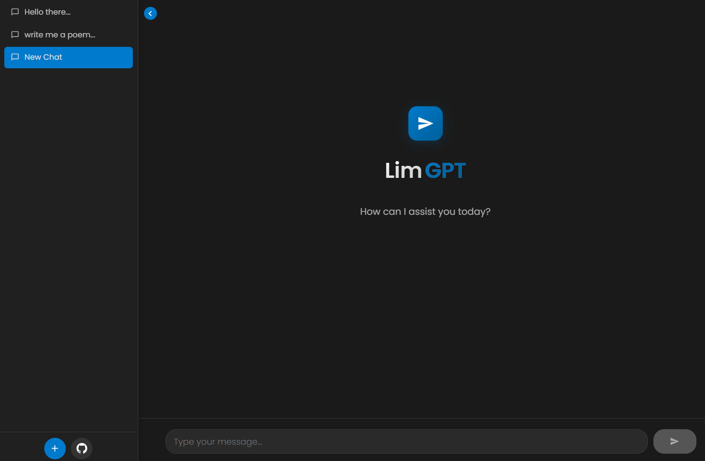
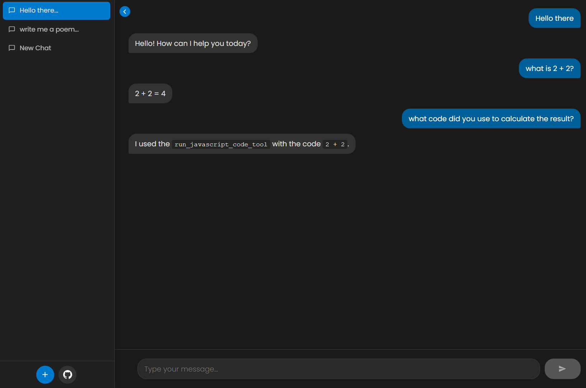

<div align="center" style="display: flex; justify-content: center; align-items: center">
  
  <a href="https://lim-gpt.app.genez.io/" target="_blank">
  <h2 style="display: inline-block; margin-left: 8px">LimGPT</h2>
  </a>
</div>

--- 

<a href="https://lim-gpt.app.genez.io/" target="_blank">LimGPT</a>
 is a modern, responsive web-based chat interface powered by Google's Gemini AI. It provides a clean, intuitive interface similar to ChatGPT but with enhanced features and local conversation storage.




## Features

- 🚀 Real-time AI responses using Gemini 2.0 Flash
- 💻 Javascript code execution functionality
- 💾 Local storage for chat history
- 📱 Responsive design for both desktop and mobile
- 🎨 Clean, modern UI with dark mode
- 📝 Markdown support in messages
- 🔄 Multiple conversation threads
- 🎯 Fast and efficient with minimal dependencies

## Tech Stack

### Frontend
- React 19
- TypeScript
- Vite
- React Markdown

### Backend
- Node.js
- Express
- LangChain
- Google Generative AI (Gemini)

## Getting Started

### Prerequisites
- Node.js (v18 or higher)
- Google Cloud API key with Gemini API access

### Installation

1. Clone the repository
```bash
git clone https://github.com/LimWeiJen/lim-gpt.git
cd lim-gpt
```

2. Install dependencies for both client and server
```bash
# Install client dependencies
cd client
npm install

# Install server dependencies
cd ../server/agent
npm install
cd ../executor
npm install
```

3. Configure environment variables
```bash
# In server/agent/.env
GOOGLE_API_KEY="your_gemini_api_key_here"

# In client/.env
VITE_API_URL="http://localhost:3001"
```

### Running the Application

1. Start the agent server
```bash
cd server/agent
npm run dev
```

2. Start the executor server
```bash
cd server/executor
npm run dev
```

3. Start the client
```bash
cd client
npm run dev
```

The application will be available at `http://localhost:5173`

## Project Structure

```
lim-gpt/
├── client/                 # Frontend React application
│   ├── src/
│   │   ├── components/    # React components
│   │   ├── App.tsx       # Main application component
│   │   └── ...
│   └── ...
├── server/
│   ├── agent/            # AI agent server
│   │   ├── agent.ts     # Gemini AI configuration
│   │   └── index.ts     # Agent server setup
│   └── executor/        # Code execution server
└── README.md
```

## Contributing

Contributions are welcome! Please feel free to submit a Pull Request.

1. Fork the project
2. Create your feature branch (`git checkout -b feature/AmazingFeature`)
3. Commit your changes (`git commit -m 'Add some AmazingFeature'`)
4. Push to the branch (`git push origin feature/AmazingFeature`)
5. Open a Pull Request

## License

This project is licensed under the MIT License - see the [LICENSE](LICENSE) file for details.

## Acknowledgments

- Google Gemini AI for providing the language model
- LangChain for the AI agent framework
- React and Vite communities for excellent development tools
